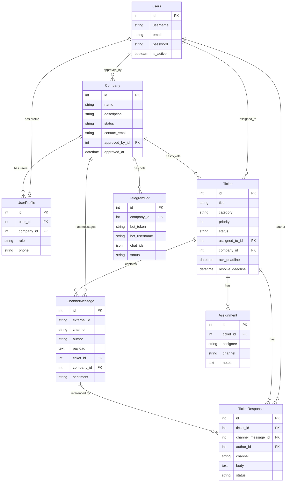

# Схема модели данных (платформа мониторинга обращений)

Описание структуры БД в стиле ER-диаграммы: таблицы, первичные ключи (PK), атрибуты, внешние ключи (FK) и связи.

---

## 1. users (Пользователи)

Стандартная модель Django `auth.User`.

- **PK:** `id`
- **Атрибуты:** `username`, `email`, `password`, `first_name`, `last_name`, `is_active`, `is_staff`, `date_joined`, …
- **Связи:** создаёт/одобряет компании; назначается на тикеты; автор ответов; связан с профилем (1:1).

---

## 2. Company (Компания)

Клиент платформы — перевозчик или оператор, чьи обращения обрабатываются.

- **PK:** `id`
- **Атрибуты:**
  - `name` — название
  - `description` — описание
  - `status` — статус (pending, active, inactive, suspended)
  - `contact_email`, `contact_phone`
  - `default_ack_sla_minutes`, `default_resolve_sla_minutes` — SLA по умолчанию
  - `created_at`, `updated_at`, `approved_at`
- **FK:** `approved_by_id` → `users.id`
- **Связи:** **Approved by** users; **has** UserProfile (сотрудники); **has** TelegramBot; **has** Ticket; **has** ChannelMessage.

---

## 3. UserProfile (Профиль пользователя)

Расширение пользователя: роль и привязка к компании.

- **PK:** `id`
- **Атрибуты:** `role` (operator, company_admin, superadmin), `phone`, `created_at`, `updated_at`
- **FK:**
  - `user_id` → `users.id` (OneToOne)
  - `company_id` → `Company.id`
- **Связи:** **Belongs to** users (1:1); **Belongs to** Company.

---

## 4. TelegramBot (Telegram-бот)

Бот компании для приёма сообщений из Telegram.

- **PK:** `id`
- **Атрибуты:**
  - `bot_token`, `bot_username`
  - `chat_ids`, `discussion_chat_ids` (JSON)
  - `allow_direct`, `status`, `last_error`
  - `created_at`, `updated_at`
- **FK:** `company_id` → `Company.id`
- **Связи:** **Belongs to** Company (у компании может быть несколько ботов).

---

## 5. Ticket (Обращение)

Одно обращение (тикет) от пользователя.

- **PK:** `id`
- **Атрибуты:**
  - `title`, `category`, `priority`, `status`
  - `sentiment`, `is_transport`, `transport_mode`
  - `assigned_group`, `ack_deadline`, `resolve_deadline`
  - `acknowledged_at`, `resolved_at`, `created_at`, `updated_at`
- **FK:**
  - `assigned_to_id` → `users.id`
  - `company_id` → `Company.id`
- **Связи:** **Belongs to** Company; **Assigned to** users; **contains** ChannelMessage; **has** Assignment; **has** TicketResponse.

---

## 6. ChannelMessage (Сообщение канала)

Входящее сообщение из канала (Telegram, Email, VK и т.д.), может породить или дополнить тикет.

- **PK:** `id`
- **Атрибуты:**
  - `external_id`, `channel`, `author`, `payload`, `metadata`
  - `received_at`, `is_transport`, `is_comment`, `transport_mode`
  - `source_chat_id`, `parent_external_id`, `thread_url`, `sentiment`
  - `created_at`
- **FK:**
  - `ticket_id` → `Ticket.id`
  - `company_id` → `Company.id`
- **Связи:** **Belongs to** Ticket (опционально); **Belongs to** Company; **referenced by** TicketResponse. Уникальность: `(external_id, channel)`.

---

## 7. Assignment (Назначение)

История назначения тикета на исполнителя (логирование).

- **PK:** `id`
- **Атрибуты:** `assignee`, `channel`, `notes`, `created_at`
- **FK:** `ticket_id` → `Ticket.id`
- **Связи:** **Belongs to** Ticket (у тикета несколько записей назначений).

---

## 8. TicketResponse (Ответ на обращение)

Исходящий ответ по тикету (в канал или внутренний).

- **PK:** `id`
- **Атрибуты:**
  - `channel`, `body`, `status`
  - `external_message_id`, `sent_at`, `created_at`
- **FK:**
  - `ticket_id` → `Ticket.id`
  - `channel_message_id` → `ChannelMessage.id` (связанное входящее сообщение)
  - `author_id` → `users.id`
- **Связи:** **Belongs to** Ticket; **References** ChannelMessage (опционально); **Authored by** users.

---

## Сводная схема связей

| От кого       | Связь        | К кому          |
|---------------|-------------|-----------------|
| users         | Approved by | Company         |
| users         | 1:1         | UserProfile     |
| users         | Assigned to | Ticket          |
| users         | Author      | TicketResponse  |
| Company       | has         | UserProfile     |
| Company       | has         | TelegramBot     |
| Company       | has         | Ticket          |
| Company       | has         | ChannelMessage  |
| Ticket        | contains    | ChannelMessage  |
| Ticket        | has         | Assignment      |
| Ticket        | has         | TicketResponse  |
| ChannelMessage| referenced by | TicketResponse |

---

## Диаграмма (Mermaid ER)

Диаграмму можно отобразить в любом редакторе с поддержкой Mermaid (GitHub, GitLab, VS Code с расширением Mermaid, Notion и т.п.).
